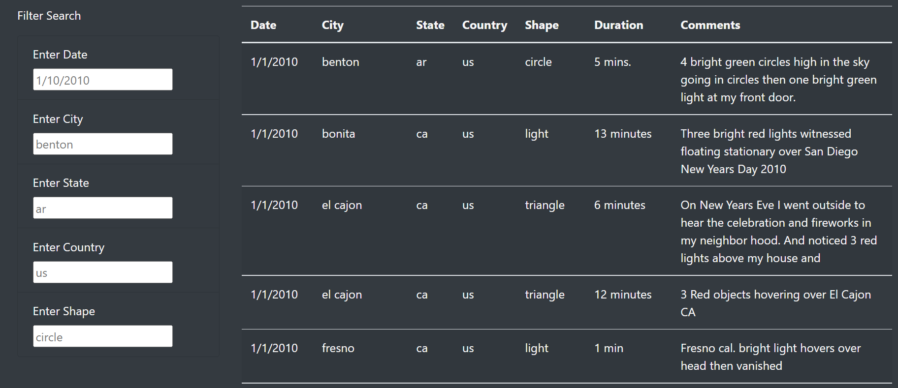
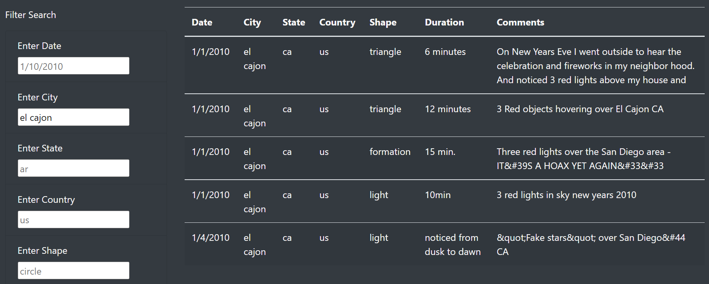
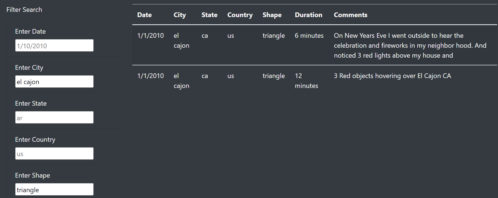

# UFOs

## Overview

A data journalist named Dana decided to write about UFOs in he home town McMinnville (Oregon). She's got a dataset with UFO episodes, and she needs an instrument to present it as a filterable table to support her research.

## Results

One can filter the data by date, city, state, country, and its shape.

Say, you start with the city, and you are interested in a city named El Cajon. To filter by it you type in the filed "Enter City", and press "Enter".

Now suppose you need only triangular UFOs. Just type "triangle" in the filed "Enter Shape", and press "Enter".

## Summary

### Drawback

The webpage works, but its user has to type in the values in its filters, which takes time and prone to typos.

### Recommendations

- Change input fields to drop-down lists with all the unique values from the relevant field in the table.
- Allow multiple values to be selected in the drop-down lists.
- Experiment with checkboxes for multiple selections, where the user can see all possible options at once. Some online shops use such interfaces, if the number of options is not too high.